## Active-Directory-HomeLab

This project documents the creation of a Windows Active Directory homelab using VirtualBox. The objective was to simulate a small enterprise network by deploying a Windows Server 2019 Domain Controller and a Windows 10 client machine. Throughout this project, I configured core Active Directory services including DNS, DHCP, RRAS, Organizational Units (OUs), user and group management, and Group Policy Objects (GPOs).

This lab provided hands-on experience with enterprise Windows Server administration while reinforcing networking concepts such as IP addressing, NAT, DHCP, DNS, and domain authentication.


## Project Objectives

- Deploy a Windows Server 2019 Domain Controller
- Configure Active Directory Domain Services
- Configure DNS and DHCP
- Configure Routing and Remote Access (RRAS)
- Implement Network Address Translation (NAT)
- Join a Windows 10 workstation to the domain
- Create Organizational Units, users, and security groups
- Deploy and validate Group Policy Objects


## Network Architecture

The lab environment consists of two virtual machines connected through separate virtual network adapters.

The Windows Server 2019 Domain Controller was configured with:

- A **NAT Adapter** to provide Internet connectivity.
- An **Internal Network Adapter** to create a private network for domain communication.

This configuration allows the Domain Controller to act as the gateway between the isolated internal network and the Internet while providing centralized authentication and network services for client machines.

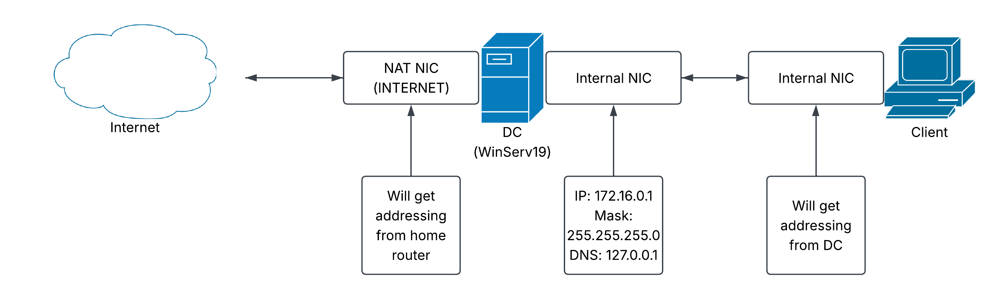

---

# Project Walkthrough

## 1. Virtual Machine Deployment

I created two virtual machines (VMs) within Oracle VirtualBox

- Windows Server 2019
- Windows 10 Pro


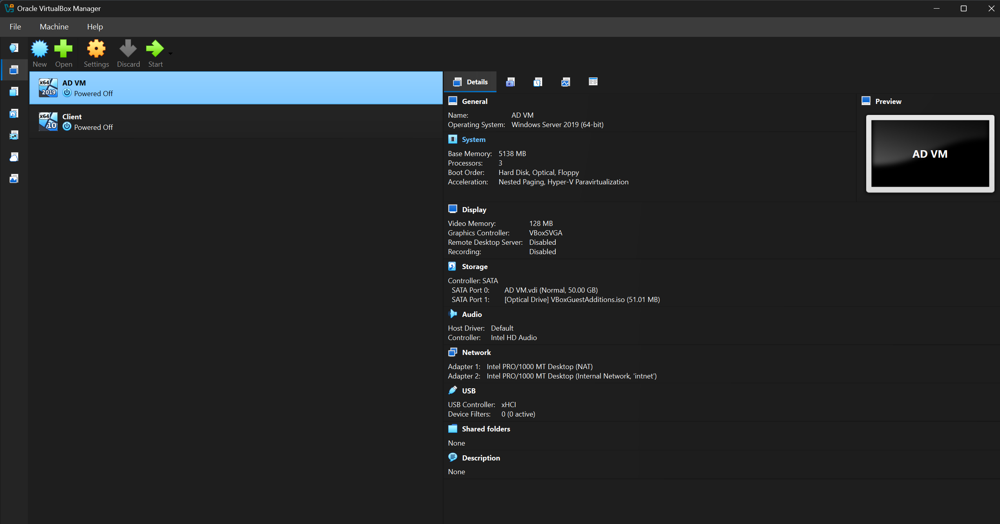

---

## 2. Network Configuration

I configured the Domain Controller with two network adapters.

### 1. NAT Adapter

The NAT adapter provides Internet access to the Domain Controller.

### 2. Internal Network Adapter

The Internal Network adapter creates an isolated private network that allows communication between the Domain Controller and domain-joined clients.

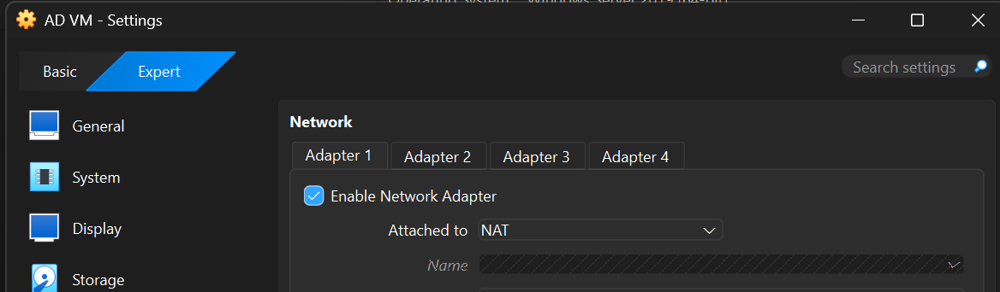
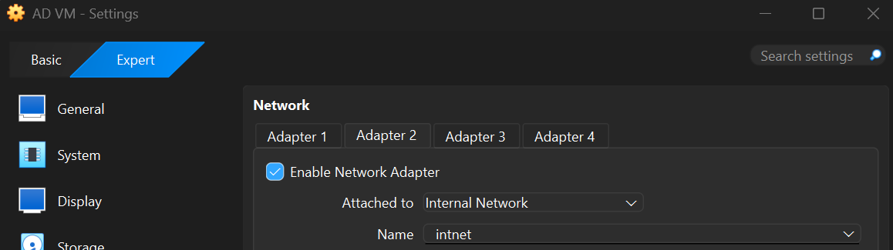

A static IPv4 address was assigned to the Internal Network interface. Because the domain controller hosts critical services such as DNS and DCHP, it must maintain a consistent IP address so that client computers always know where to locate these services. If the server's IP address were to change, clients could experience issues with name resolution, obtaining IP addresses, and authenticating to the Active Directory domain.

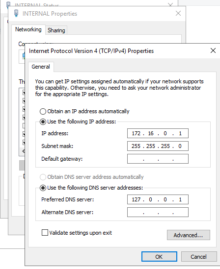

---

## 3. Active Directory Installation

I installed Active Directory Domain Services role through Server Manager.

After installing the role, the server was promoted to a Domain Controller by creating a new Active Directory forest. During the promotion process, the root domain was configured as:

```
mydomain.com
```
Mydomain.com serves as a centralized administrative boundary where users, computers, and security policies can be easily managed from a single location.

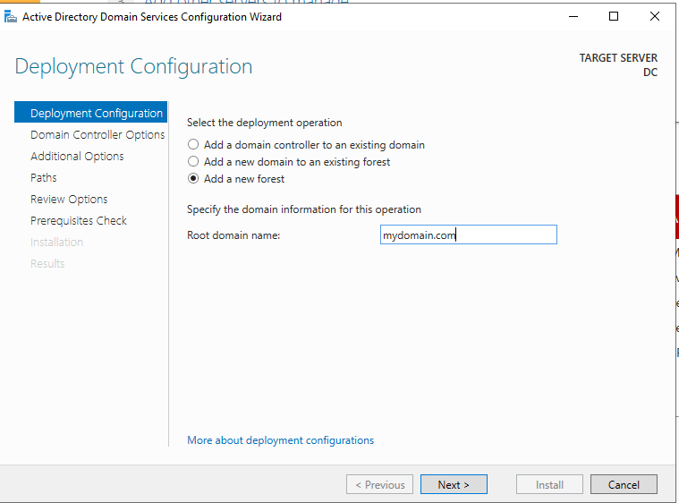

---


## 4. Organizational Units and Administrative Accounts

To organize privileged accounts, I created an Organizational Unit named **_ADMINS** was created. Additionally, I created an administrative user account and then added the user to the **Domain Admins** security group.

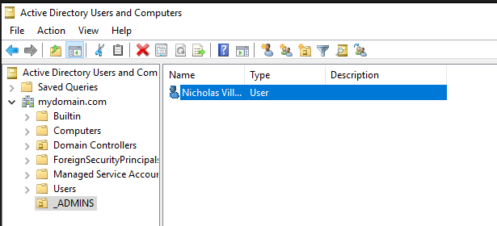
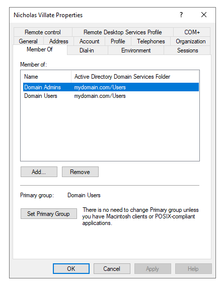

---

## 5. Routing and Remote Access (RRAS)

The Routing and Remote Access Service (RRAS) role was installed and configured to implement Network Address Translation (NAT) on the Domain Controller’s NAT network adapter. This configuration enables computers on the isolated internal network to access external networks through the Domain Controller without exposing the private network directly. The Domain Controller effectively acts as a gateway, translating internal private IP addresses into a routable address for outbound traffic.

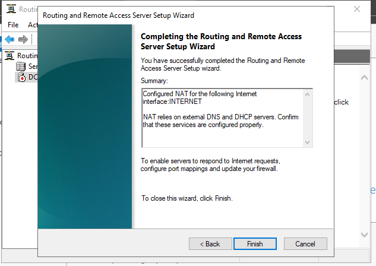

---

## 6. DHCP Configuration

The DHCP Server role was installed and configured to automatically assign IP addresses to client computers joining the domain. Installing a DCHP server simplifies workstation deployment and reduces the likelihood of addressing conflicts.

The DHCP scope included:

| Setting | Value |
|----------|-------|
| Address Range | 172.16.0.100 - 172.16.0.200 |
| Subnet Mask | 255.255.255.0 |
| Default Gateway | 172.16.0.1 |
| DNS Server | 172.16.0.1 |
| Lease Duration | 2 Days |


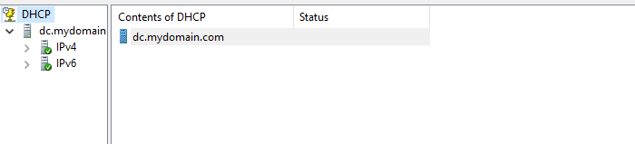


---

## 7. Windows 10 Client Deployment

A Windows 10 Pro virtual machine was deployed and connected to the Internal Network. After booting, the client successfully obtained an IP address from the DHCP server and was joined to the **mydomain.com** domain. Domain authentication was then verified by logging into the workstation using domain credentials.

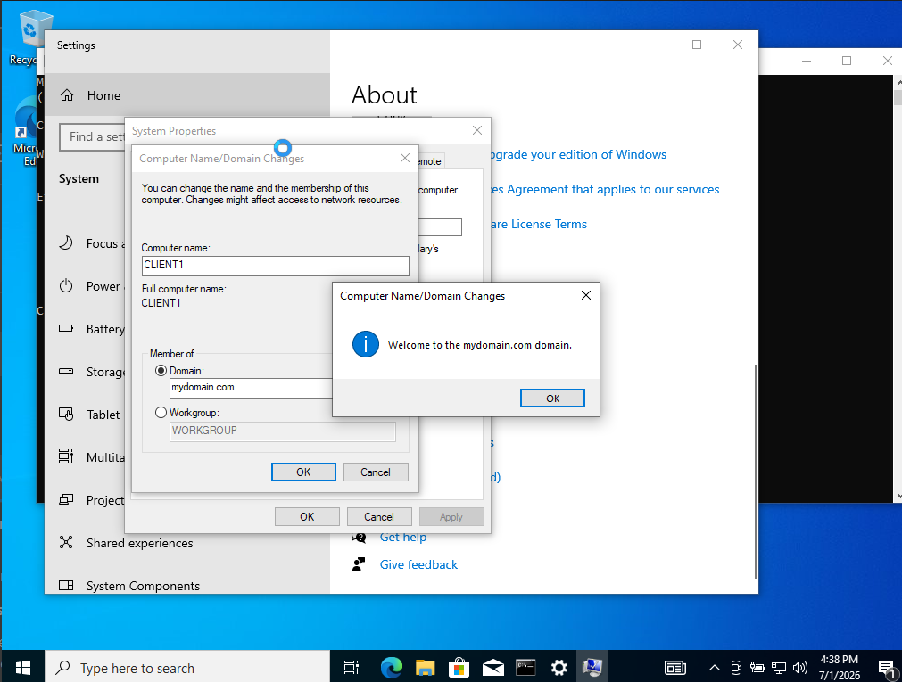
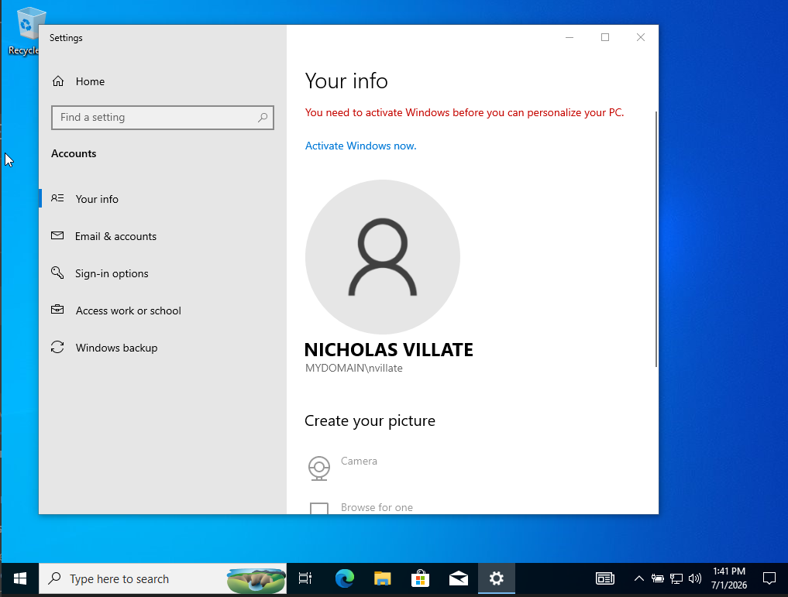


---

## 8. Group Policy Management

I simulated creating a Group Policy Object (GPO) to apply a targeted policy specifically to HR user accounts, demonstrating role-based policy management and real-world Active Directory administration.

First, I created a dedicated HR OU and placed an HR user account within it. I created GPO which had a rule stating that users could not access the Control Panel application. The GPO was then linked to the HR OU and I used security filtering so that the policy would only apply to the intended HR security group. After configuring the policy, I verified that it was successfully applied to the user using the following commands:

```cmd
gpupdate /force
```

and

```cmd
gpresult /r
```

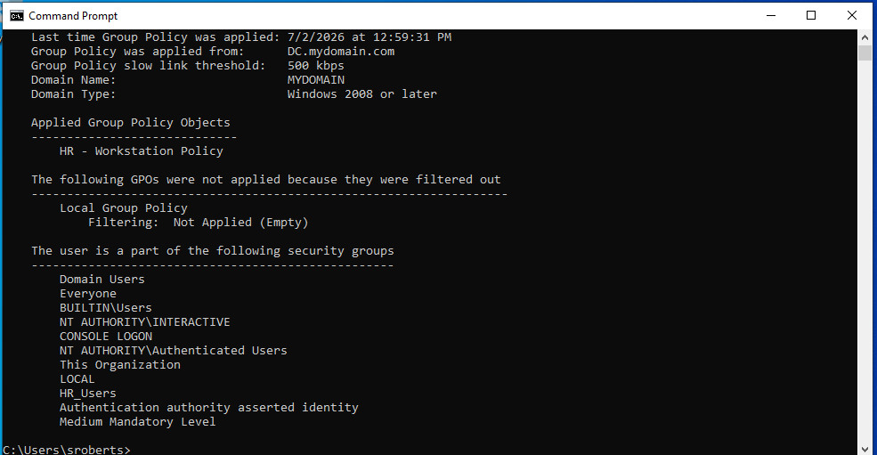


---
## 9. Password Reset 

To simulated an AD administration task, I performed a password reset on a domain user account within the HR OU. Password resets are often a common task to help users who are locked out of their account or have forgotten their credentials. The password reset was performed using Active Directory Users and Computers by selecting the user account and assigning a temporary password. The option to require the user to change their password at next logon can also be enforced to maintain account security standards.

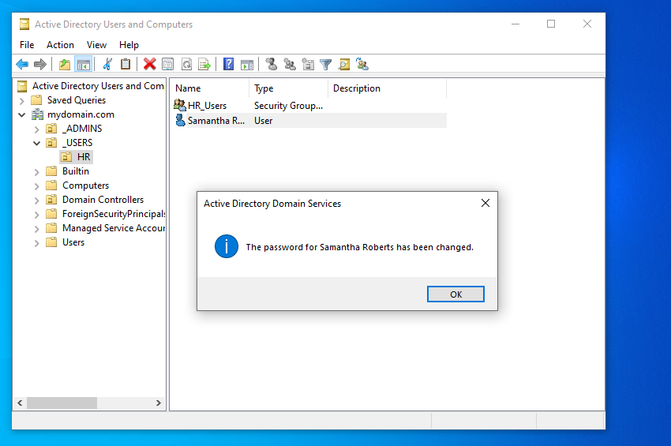

---

# Skills Demonstrated

- Active Directory Domain Services (AD DS)
- Windows Server 2019 Administration
- Windows Networking
- DNS Server Configuration
- DHCP Server Configuration
- Routing and Remote Access (RRAS)
- Network Address Translation (NAT)
- Organizational Unit Management
- User and Secruity Group Administration
- Group Policy Management
- Windows Client Deployment
- Domain Authentication


---

# Technologies Used

- Windows Server 2019
- Windows 10 Pro
- Oracle VirtualBox
- Active Directory
- DNS
- DHCP
- RRAS
- Group Policy Management Console (GPMC)

---

# Lessons Learned

This project help me understand how core Windows Server technologies work together to support an enterprise environment. By deploying AD from scratch, I gained pratical experience configuring domain infrastructure, managing centralized authentication, implementing services such as DNS and DCHP, and deploying Group Policy. As a result, I developed a stronger understanding of how to use Active Directory and implementing networking services.

---

# References
This project was partially completed following a youtube Active Directory lab tutorial. I recreated the environment step by step and explained each step in my own words to demostrate comprehension beyond the video. Here is the video for reference: https://www.youtube.com/watch?v=MHsI8hJmggI


